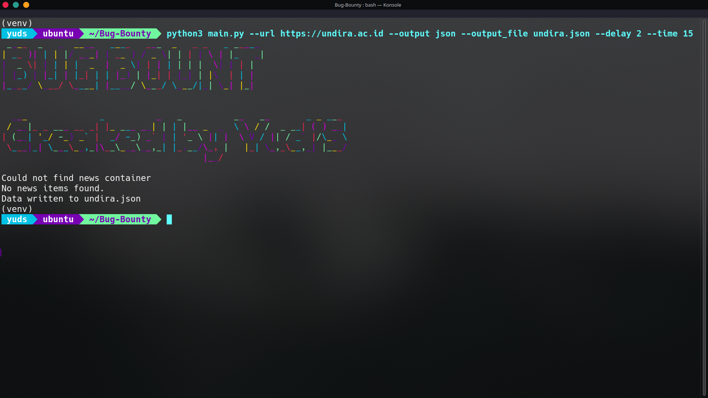

# Bug Bounty Scraper

This is a Python script designed to scrape information from websites that list bug bounty programs or provide news headlines.

## Features

*   Scrapes data from a given website
*   Outputs results in text, CSV, or JSON format.
*   Uses `requests` and `beautifulsoup4` for web scraping.
*   Uses `pyfiglet` and ANSI codes for generating colorful banners.
*   Has retry logic and time limits.
*  Has configurable delays.

## How to Use

1.  **Clone the Repository:**
    ```bash
    git clone https://github.com/yudiiansyaah/bug-bounty.git
    cd bug-bounty-scraper
    ```
2.  **Install dependencies:**
     ```bash
    pip install requests beautifulsoup4 pyfiglet lolcat
     ```
3.  **Run the Script:**
    *   **Basic usage (text output):**
        ```bash
        python3 main.py --url <website_url>
        ```
    *   **CSV Output:**
        ```bash
        python3 main.py --url <website_url> --output csv --output_file output.csv
        ```
    *   **JSON Output:**
         ```bash
        python3 main.py --url <website_url> --output json --output_file output.json
        ```
   *   **Custom Delay and Time Limit:**
        ```bash
        python3 main.py --url <website_url> --delay 2 --time 15
        ```

    Replace `<website_url>` with the actual URL you want to use (e.g., `https://www.undira.ac.id`).


## Notes

*  Please adjust the HTML tags in the `extract_news` function to work with the website that you're scraping.
* This script is designed for educational purposes. Always be respectful of website terms of service and avoid overloading servers.

## License

This project is licensed under the [MIT License](https://opensource.org/licenses/MIT).
